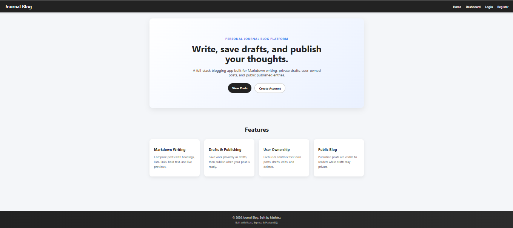
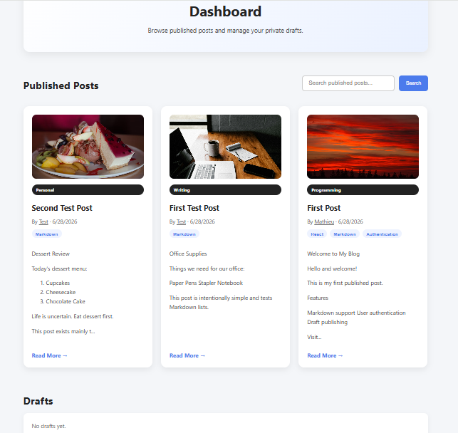
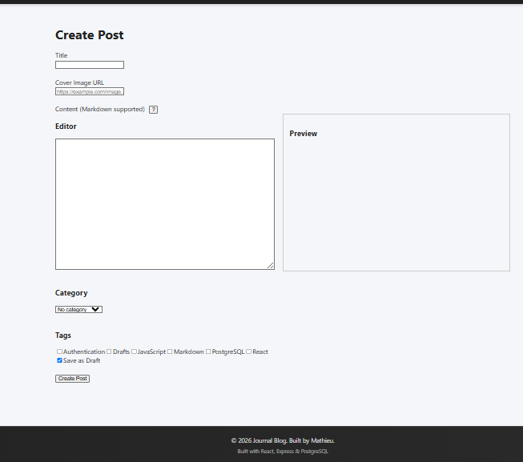
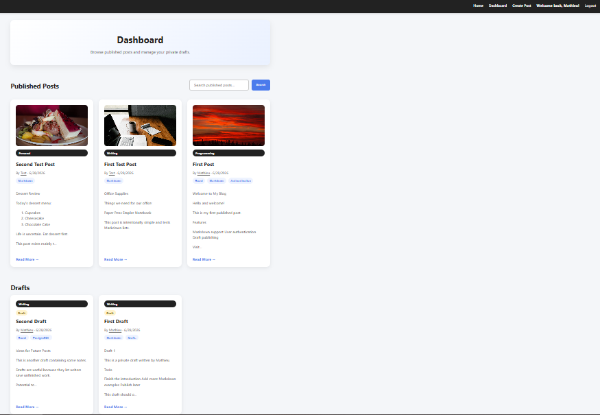
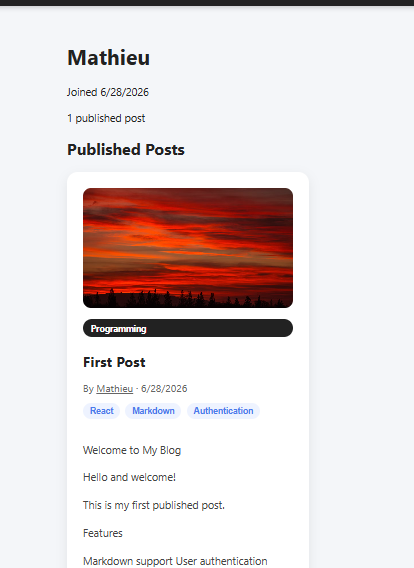
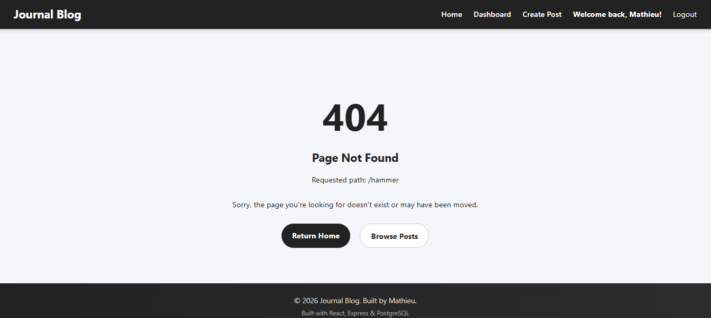

# Journal Blog Platform



A full-stack journal and blogging application built with React, Express, PostgreSQL, and JWT authentication.

Users can register, log in, create published posts or private drafts, write content using Markdown, organize posts with categories and tags, add image URLs, search published posts, and view public author profiles.

## Table of Contents

- Features
- Technology Stack
- Installation
- Environment Variables
- Running the Application
- Usage
- API Routes
- Screenshots
- Deployment
- Future Improvements

## Features

- User registration and login
- Password hashing with bcrypt
- JWT-based authentication
- Protected frontend routes
- Backend ownership authorization
- Private user-specific drafts
- Create, read, update, and delete posts
- Publish and unpublish posts
- Markdown rendering and preview
- Post categories
- Many-to-many post tags
- Optional post images using image URLs
- Search and tag filtering
- Public user profiles
- Toast notifications
- Custom frontend and API 404 handling
- PostgreSQL transactions for post and tag updates
- Responsive navigation and reusable React components

## Repository

https://github.com/MathieuSmuk/journal-blog

## Live Demo

Deployment coming soon.

## Demo Accounts

The seeded database includes two demonstration accounts.

### Account 1

- Email: `mathieu@example.com`
- Password: `TestAccount1`

### Account 2

- Email: `test@example.com`
- Password: `TestAccount2`

These credentials are intended only for the public demonstration environment. Do not reuse these passwords for personal accounts.

Each account has its own private drafts. Logging in with both accounts can be used to verify that users cannot access or modify drafts belonging to another account.

## Technology Stack

### Frontend

- React 19
- Vite 7
- React Router
- React Hot Toast
- Markdown rendering
- CSS

### Backend

- Node.js
- Express 5
- JSON Web Tokens
- bcrypt
- CORS

### Database

- PostgreSQL
- `pg` PostgreSQL client
- Relational tables for users, posts, categories, tags, and post-tag relationships

## Project Structure

```text
journal-blog/
├── .gitignore
├── README.md
├── client/
│   ├── public/
│   ├── src/
│   │   ├── assets/
│   │   ├── components/
│   │   │   ├── layout/
│   │   │   ├── routes/
│   │   │   └── ui/
│   │   ├── config/
│   │   ├── context/
│   │   ├── hooks/
│   │   ├── pages/
│   │   ├── services/
│   │   ├── styles/
│   │   ├── utils/
│   │   ├── App.jsx
│   │   └── main.jsx
│   ├── .env.example
│   ├── package.json
│   └── vite.config.js
├── docs/
│   └── screenshots/
└── server/
    ├── config/
    ├── controllers/
    ├── db/
    │   ├── schema.sql
    │   └── seed.sql
    ├── middleware/
    ├── models/
    ├── routes/
    ├── utils/
    ├── .env.example
    ├── package.json
    └── server.js

    Note: node_modules, .env, and production build folders are intentionally omitted from the project structure because they are generated locally and are excluded from version control.
```

## Database Design

The application uses five main tables:

### `users`

Stores user accounts and hashed passwords.

### `posts`

Stores post content, draft status, ownership, image URLs, categories, and timestamps.

### `categories`

Stores the available post categories.

### `tags`

Stores reusable tag names.

### `post_tags`

A junction table that creates the many-to-many relationship between posts and tags.

Important database relationships include:

- One user can own many posts.
- One category can be assigned to many posts.
- One post can have many tags.
- One tag can belong to many posts.
- Deleting a user deletes that user's posts.
- Deleting a post removes its tag relationships.
- Deleting a category sets affected post categories to `NULL`.

## Security Features

The application includes several security and data-protection measures:

- Passwords are hashed with bcrypt before storage.
- Successful logins return a signed JWT.
- Protected API routes require a valid bearer token.
- Ownership checks prevent users from editing or deleting another user's posts.
- Drafts are visible only to their owners.
- Unauthorized draft requests return `404` to avoid revealing that the draft exists.
- SQL queries use parameterized values.
- API queries explicitly select safe fields instead of using `SELECT *`.
- Public profile responses do not expose user email addresses or password hashes.
- Database transactions prevent partial post and tag updates.
- Environment variables are used for secrets and deployment configuration.

## Local Installation

### Prerequisites

Install the following before running the project:

- Node.js
- npm
- PostgreSQL
- pgAdmin 4 or another PostgreSQL client
- Git

### 1. Clone the repository

```bash
git clone https://github.com/MathieuSmuk/journal-blog.git
cd <your-project-folder>
```

### 2. Install frontend dependencies

```bash
cd client
npm install
```

### 3. Install backend dependencies

Open another terminal from the project root:

```bash
cd server
npm install
```

### 4. Create the PostgreSQL database

Create a PostgreSQL database for the application. For example:

```text
journal_blog
```

Run `schema.sql` against the new database to create the tables.

Then run `seed.sql` to add the demonstration users, categories, posts, tags, and post-tag relationships.

The schema file drops and recreates the application tables. Do not run it against a database containing data you need to preserve.

## Environment Variables

Create a `.env` file in the server folder.

Example:

```env
DB_USER=postgres
DB_HOST=localhost
DB_NAME=journal_blog
DB_PASSWORD=your_password
DB_PORT=5432
JWT_SECRET=replace_with_a_long_random_secret
CLIENT_URL=http://localhost:5173
PORT=3000
```

Use the variable format that matches the database connection file in the project.

Do not commit the `.env` file to GitHub.

Create a `.env.example` file containing only placeholder values so other developers know which variables are required.

Example:

```env
DB_USER=postgres
DB_HOST=localhost
DB_NAME=journal_blog
DB_PASSWORD=your_database_password
DB_PORT=5432
JWT_SECRET=your_long_random_secret
PORT=3000
CLIENT_URL=http://localhost:5173
```

## Running the Application

### Start the backend

From the server folder:

```bash
npm run dev
```

For a production-style startup:

```bash
npm start
```

The API should run at:

```text
http://localhost:3000
```

Opening the root backend route should return:

```json
{
  "message": "Journal Blog API is running"
}
```

### Start the frontend

From the client folder:

```bash
npm run dev
```

Vite will normally run the frontend at:

```text
http://localhost:5173
```

## Production Build

To verify that the React frontend can compile for production:

```bash
cd client
npm run build
```

Vite creates the optimized production files inside:

```text
client/dist/
```

To preview the production build locally:

```bash
npm run preview
```

## Application Usage

### Browsing posts

The dashboard displays published posts from all users.

Visitors can:

- Read published posts
- Search for posts
- Filter posts by tags
- View categories
- Visit public user profiles

### Creating an account

Open the Register page and enter a username, email address, and password.

After registration, log in using the new account.

### Creating a post

After logging in:

1. Open the Create Post page.
2. Enter a title.
3. Write the post content using Markdown.
4. Optionally add an image URL.
5. Choose a category.
6. Select one or more tags.
7. Choose whether to save the post as a draft or publish it.
8. Submit the form.

### Working with drafts

Drafts are private and appear only for the logged-in owner.

A user can:

- Create a draft
- Edit a draft
- Add or remove tags
- Change its category
- Add or remove an image
- Publish it later
- Delete it

Users cannot view drafts belonging to other accounts, even when directly entering another draft's URL.

### Editing and deleting posts

The owner of a post can open its detail page and select Edit or Delete.

Deletion requires confirmation and displays a toast notification after completion.

## API Routes

### Authentication

POST /api/auth/register
POST /api/auth/login

### Posts

GET /api/posts
GET /api/posts/my-drafts
GET /api/posts/:id
POST /api/posts
PUT /api/posts/:id
DELETE /api/posts/:id

### Tags

GET /api/tags
POST /api/tags
PUT /api/tags/:id

### Categories

GET /api/categories

### Users

GET /api/users/:id

The exact route behavior and response fields can be reviewed in the server route and controller files.

## Suggested Testing Checklist

Before deployment, verify the following:

- A new user can register.
- A registered user can log in.
- Invalid login credentials produce an error.
- Logout removes the stored token and user.
- Expired or invalid sessions redirect to Login.
- A user can create a published post.
- A user can create a private draft.
- Drafts are visible only to their owners.
- Direct requests for another user's draft return `404`.
- A post can be edited.
- A draft can be published.
- A published post can be changed back into a draft.
- Tags can be added and removed.
- Categories can be changed or cleared.
- Image URLs can be added and removed.
- Markdown headings, lists, links, bold text, and blockquotes render correctly.
- Search returns matching posts.
- Tag filtering works.
- Public user profiles show published posts but not drafts.
- Only a post owner can edit or delete it.
- Deleting a post removes it from the database.
- The frontend custom 404 page works.
- Invalid backend routes return a JSON `404` response.
- Toast notifications appear for successful and failed actions.
- The frontend production build completes successfully.

## Deployment

A suitable deployment setup is:

- Frontend: Render static site
- Backend: Render web service
- Database: Neon PostgreSQL

Production environment variables should include:

```env
DATABASE_URL=<your-neon-connection-string>
JWT_SECRET=<your-production-secret>
CLIENT_URL=<your-deployed-frontend-url>
PORT=<provided-by-host>
```

The frontend API configuration should use the deployed backend URL rather than a hardcoded localhost address.

After deployment, update this README with:

```text
Live application: <frontend-url>
API health check: <backend-url>
```

## Screenshots

### Home


### Dashboard



### Create Post



### Post details


### Drafts



### Profile



### 404 page



## Known Limitations

- Images are added through external image URLs rather than uploaded directly.
- JWTs are stored in browser local storage.
- The application does not currently support password reset emails.
- There are no comments, likes, bookmarks, or follower systems.
- The Markdown editor does not provide collaborative editing.
- Demo accounts use publicly documented credentials and should not contain sensitive information.

## Future Improvements

Possible future enhancements include:

- Direct image uploads using cloud storage
- Password reset and email verification
- Refresh tokens or secure HTTP-only cookie authentication
- Post comments
- Likes and bookmarks
- Pagination
- Rich text editing
- Automated tests
- Accessibility improvements
- Dark mode
- User avatars

## Key Learning Outcomes

This project allowed me to gain practical experience with:

- Designing a relational PostgreSQL database
- Building a RESTful API with Express
- Creating a React single-page application
- Managing authentication using JWT
- Implementing authorization for protected resources
- Handling many-to-many database relationships
- Deploying a full-stack application

## What This Project Demonstrates

This project demonstrates experience with:

- Building a complete React frontend
- Designing REST API routes with Express
- Creating and querying a relational PostgreSQL database
- Implementing authentication and authorization
- Protecting private user data
- Managing many-to-many relationships
- Using transactions for multi-step database operations
- Rendering Markdown content
- Handling frontend and backend errors
- Preparing an application for production deployment

## Author

Mathieu Smuk

## License

This project is intended as a portfolio and educational project.

Add a license file if you plan to allow others to copy, modify, or redistribute the code.
